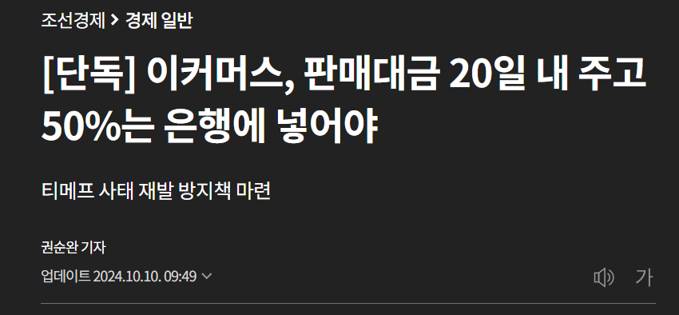
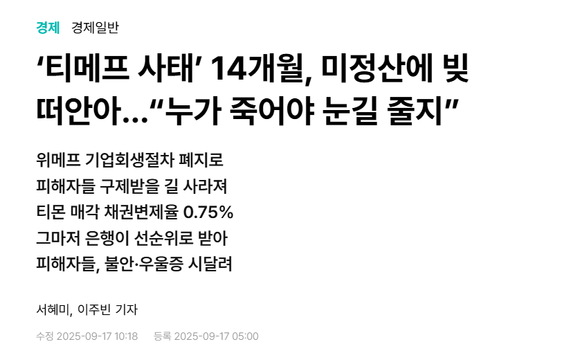
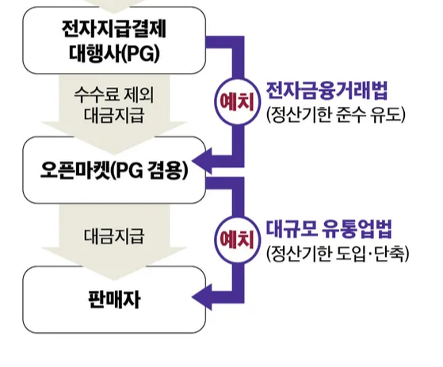
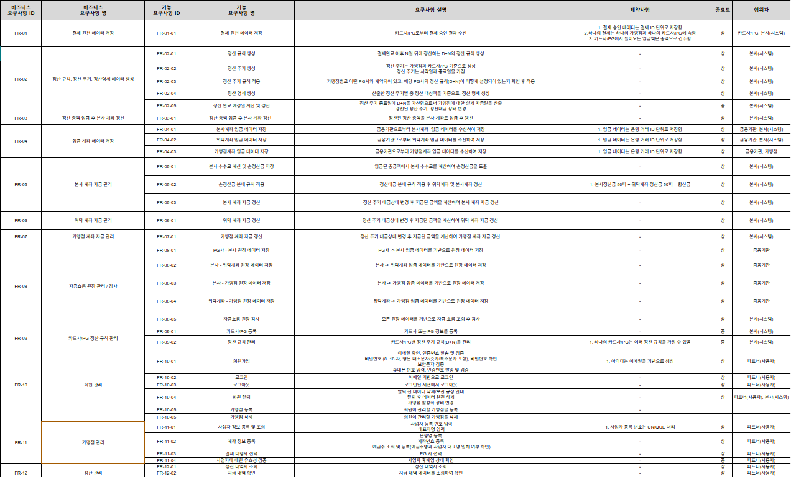
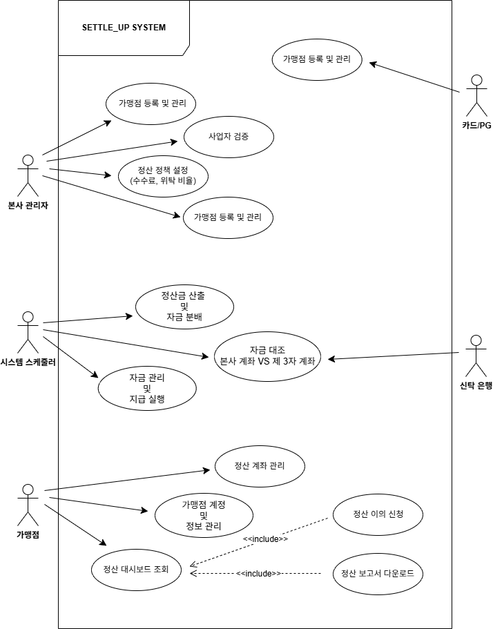
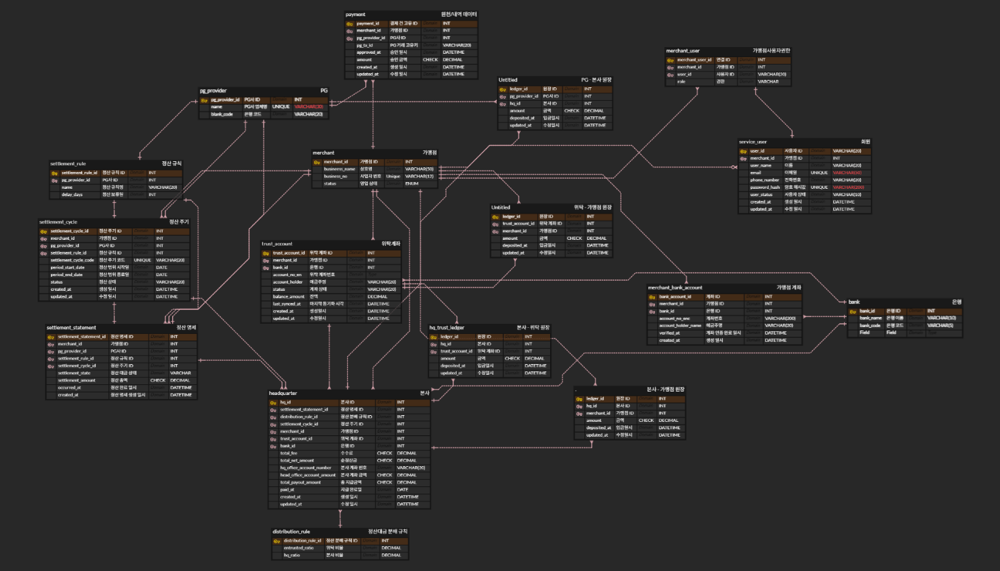
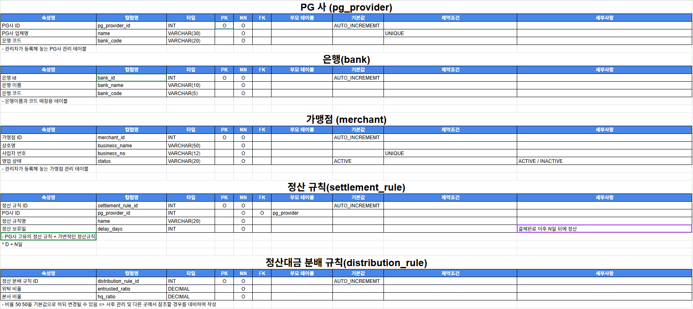

# 🔐 신탁 기반 정산 시스템

# 👥 flow 팀원 소개

<table>
  
  <tr>
    <th>김진혁</th>
    <th>박하얀</th>
    <th>양준석</th>
    <th>이진</th>
    <th>한규진</th>
    <th>황희수
  </tr>
  
  <tr>
    <td align="center"></td>
    <td align="center"></td>   
    <td align="center"></td>   
    <td align="center"></td>  
    <td align="center"></td>   
    <td align="center"></td>  
  </tr>

  <tr>
    <td align="center">
      
    </td> 
    <td align="center">
      
    </td>
    <td align="center">
      
    </td>
    <td align="center">
      
    </td>
    <td align="center">
      
    </td>
    <td align="center">
      
    </td>
  </tr>
</table>
    
---

# 🧭 목차

1. [📚 프로젝트 개요](#1--프로젝트-개요)
2. [🛠️ 주요 기능](#2-%EF%B8%8F-주요-기능)
3. [📅 WBS](#3--wbs)
4. [📋 기획서](#4--기획서)
5. [🧾 요구사항 명세서](#5--요구사항-명세서)
6. [🧵 유스케이스](#6--유스케이스)
7. [🧩 ERD](#7--erd)
8. [🗃 테이블 명세서](#8--테이블-명세서)
9. [🗄️ SQL](#9-%EF%B8%8F-sql)
10. [⚙️ 프로시저](#10-%EF%B8%8F-프로시저)
11. [📰 시나리오](#11--시나리오)
12. [💬 팀회고](#12--팀회고)
---

# 1. 📚 프로젝트 개요

### 💡 개발 배경 및 필요성
국내 이커머스 시장은 급속한 성장을 이루었으나, 정산 인프라는 여전히 구조적 취약성을 내포하고 있습니다. 
2024년에 발생한 <b>'티몬·위메프(티메프) 사태'</b>는 플랫폼이 판매자에게 지급해야 할 정산 대금을 별도 분리 없이 회사 운영 자금으로 사용하며 발생했습니다.  
이로 인해 약 4만 8천 개의 판매업체가 1조 원이 넘는 미정산 피해를 입었으며, 
이는 곧 소비자의 상품 배송 중단 및 환불 거부로 이어져 막대한 사회적 비용을 발생시켰습니다.  

   
  

티메프 사태 이후 정부는 일정 규모 이상의 플랫폼에 대해 정산 대금의 50% 이상을 금융기관에 별도 예치(신탁)하도록  법 개정을 완료함에 따라,
기업들은 자금 운영의 유동성을 확보하면서도, 보다 엄격해진 정산·보관 기준을 함께 충족해야 하는 상황에 놓이게 되었습니다. 
하지만 실제 현장에서는 여전히 파편화된 결제 수단과 복잡한 수수료 구조를 수기나 불투명한 내부 시스템에 의존하고 있어,  자금 흐름의 투명성이 확보가 되지 못하고 있습니다. 이러한 구조는 본사와 가맹점 간의 신뢰를 저해하고, 소상공인의 경영  안정성을 위협하는 원인이 되고 있습니다.

---

# 2. 🛠️ 주요 기능

### 🎯 서비스 목표
본 서비스는 판매자 정산 대금이 플랫폼 운영 자금과 분리되어 안전하게 관리될 수 있도록 자금 격리 기반 정산 아키텍처를  구축하고, 결제부터 입금까지의 전 과정을 데이터로 투명하게 기록·검증할 수 있는 B2B 정산 관리 환경을 제공하는 것을  목표로 합니다.  

  

 

**🔒 가변적 자금 격리 및 법적 컴플라이언스 준수**

법에서 요구하는 최소 예치비율을 자동으로 산출·모니터링하고, 해당 금액을 제3의 금융기관(신탁계좌)에 별도로 관리합니다.
이를 통해 플랫폼은 운영자의 유동성을 유지하면서도, 판매자 정산 대금이 일반 운영 자금과 혼재되지 않도록 구조적으로  분리된 관리 체계를 구축할 수 있습니다.  

**⚙️ 다채널 통합 및 기업형 정산 자동화**

카드, 간편결제, 후불결제 등 상이한 정산 주기와 수수료 체계를 가진 결제 데이터를 하나의 표준 규격으로 통합합니다.  가맹점 계약 조건에 따른 수수료, 공제액, 로열티 등을 자동 산출하고, 정산은 업계 표준 계약서에서 일반적으로 사용하는  정산 기한 기준에 맞춰 정산 자동화를 설계합니다.  

**🤝 투명한 데이터 대조 및 상생 생태계 조성**

시스템 내 정산 결과와 실제 은행·카드사 입금 데이터를 실시간으로 대조하여 오차 여부를 투명하게 공개합니다.  가맹점주에게는 '보호 중인 금액', ‘정산 예정 금액’, ‘입금 일정’ 등을 직접 확인할 수 있습니다. 이를 통 본사와 가맹점 간의  정보 비대칭을 해소하고, 정산 신뢰를 기반으로 한 안정적인 파트너십 구조를 형성에 기여합니다.

---

# 3. 📅 WBS
 
[ WBS (프로젝트 진행 일정)](https://docs.google.com/spreadsheets/d/1XrcdHR66LJBE2SWYMY66MDVdNAcpkelMdxSjatsnTk0/edit?gid=0#gid=0)

---

# 4. 📋 기획서

---

# 5. 🧾 요구사항 명세서
 
[ 요구사항 명세서 ](https://docs.google.com/spreadsheets/d/1t-3yzFlvFUKhRYMtjQxSj4t5rjAZPjR0/edit?gid=1080029165#gid=1080029165)

---

# 6. 🧵 유스케이스

  

---

# 7. 🧩 ERD
이미지 다시 변경

[ ERD ](https://www.erdcloud.com/d/uzGd5MBTRGSqNebu2)

---

# 8. 🗃 테이블 명세서
이미지 다시 변경
 
[ 테이블 명세서 ](https://docs.google.com/spreadsheets/d/1HM-mU0-lc_Kd9HSFikO5GXxtWctQNYoIqnbgs6Q8_N0/edit?gid=993473287#gid=993473287)

---

# 9. 🗄️ SQL

    
DDL

#### PG사 테이블

#### 은행 테이블

#### 가맹점 테이블

#### 가맹점 PG사 연결 테이블

#### 정산 규칙 테이블

#### 정산대금 분배 규칙 테이블

#### 원천/내역 데이터 테이블

#### 정산 주기 테이블

#### 정산 명세 테이블

#### 본사 테이블

#### 위탁 계좌 테이블

#### 회원 테이블

#### 가맹점 사용자 권한 테이블

#### 가맹점 계좌

#### PG-본사 간 원장 테이블

#### 본사-가맹점,회원 간 원장 테이블

#### 본사-위탁 간 원장 테이블

#### 위탁-가맹점,회원 간 원장 테이블

    
DML

  

  
Test Case

  
  

      
FR-08-05 : 자금흐름 원장 감사

       <h3>가맹점 기준 전체 자금 흐름 타임라인 감사</h3>
       
       <h3>본사 기준 들어온 돈 vs 나간 돈 감사</h3>
       
       <h3>위탁계좌 기준 감사</h3>
       
       <h3>정산 1건(hq_id) 단위 정합성 감사</h3>
       
    
  

 

---

# 10. ⚙️ 프로시저

---

# 11. 📰 시나리오
확정X) 

---

# 12. 💬 팀회고

#### 🦊김진혁
> 시도하였던 것

그동안 많은 협업 경험이 있었지만, SW 프로젝트의 팀장을 맡은 것은 이번이 처음이었습니다.  리더로서 프로젝트 전반을 깊이 이해해야 한다는 책임감에 모든 과정에 적극적으로 참여하여, 크고 작은 사안마다 팀원들과 소통하며 의견을 조율했습니다.  특히 금융이라는 복잡한 주제에 도전하며 도메인 지식을 확장하기 위해 노력했습니다.

> 좋았던 점

열정적인 팀원들 덕분에 까다로운 주제를 성공적으로 풀어낼 수 있었습니다.  모든 팀원이 각자 맡은 역할을 끝까지 책임지고, 최선의 결과물을 위해 끊임없이 논의하며 수정해 나갔던 과정이 팀 전체에 큰 시너지를 만들어냈습니다.

> 아쉬웠던 점

첫 SW 프로젝트 리딩이다 보니, 전체적인 로드맵을 그리기보다 당면한 문제에 치중하여 다소 근시안적으로 팀을 이끈 점이 아쉽습니다.  또한 경험 부족으로 인해 결과물에 대한 확신이 부족했고, 이로 인해 신속한 의사결정을 내리지 못했던 점이 보완해야 할 과제로 남았습니다.  이를 해결하기 위해 다음 프로젝트 전까지 이전 기수의 우수 사례들을 분석하며 부족한 경험치를 채워 나갈 계획입니다.

#### 🐹박하얀
> 시도하였던 것

> 좋았던 점

> 아쉬웠던 점

#### 🐑양준석
> 시도하였던 것

> 좋았던 점

> 아쉬웠던 점

#### 🥔이진
> 시도하였던 것

> 좋았던 점

> 아쉬웠던 점

#### 👨‍🚒한규진
> 시도하였던 것

> 좋았던 점

> 아쉬웠던 점

#### 🐻황희수
> 시도하였던 것

> 좋았던 점

> 아쉬웠던 점
