# 🔐 신탁 기반 정산 시스템

<p align="center">

</p>

---

# 👥 flow 팀원 소개

<table>
  
  <tr>
    <th>김진혁</th>
    <th>박하얀</th>
    <th>양준석</th>
    <th>이진</th>
    <th>한규진</th>
    <th>황희수
  </tr>
  
  <tr>
    <td align="center"></td>
    <td align="center"></td>   
    <td align="center"></td>   
    <td align="center"></td>  
    <td align="center"></td>   
    <td align="center"></td>  
  </tr>

  <tr>
    <td align="center">
      <a href="https://github.com/jin605"></a>
    </td> 
    <td align="center">
      <a href="https://github.com/P-HAYAN"></a>
    </td>
    <td align="center">
      <a href="https://github.com/YJunSuk"></a>
    </td>
    <td align="center">
      <a href="https://github.com/LeeJin0801"></a>
    </td>
    <td align="center">
      <a href="https://github.com/softworldqjin"></a>
    </td>
    <td align="center">
      <a href="https://github.com/huisu73"></a>
    </td>
  </tr>
</table>
    
---


# 🧭 목차

1. [📚 프로젝트 개요](#1--프로젝트-개요)
2. [🛠️ 주요 기능](#2-%EF%B8%8F-주요-기능)
3. [📅 WBS](#3--wbs)
4. [🧾 요구사항 명세서](#4--요구사항-명세서)
5. [🧵 유스케이스](#5--유스케이스)
6. [🧩 ERD](#6--erd)
7. [🗃 테이블 명세서](#7--테이블-명세서)
8. [🗄️ SQL](#8-%EF%B8%8F-sql)
9. [💬 팀회고](#9--팀회고)
---


# 1. 📚 프로젝트 개요

### 💡 개발 배경 및 필요성
국내 이커머스 시장은 급속한 성장을 이루었으나, 정산 인프라는 여전히 구조적 취약성을 내포하고 있습니다. 2024년에 발생한 <b>'티몬·위메프(티메프) 사태'</b>는 플랫폼이 판매자에게 지급해야 할 정산 대금을 별도 분리 없이 회사 운영자금으로 사용하며 발생했습니다. 이로 인해 약 4만 8천 개의 판매업체가 1조 원이 넘는 미정산 피해를 입었으며, 이는 곧 소비자의 상품 배송 중단 및 환불 거부로 이어져 막대한 사회적 비용을 발생시켰습니다.</br></br>
<p align="center">
  <br>
  
</p>
티메프 사태 이후 정부는 일정 규모 이상의 플랫폼에 대해 정산 대금의 50% 이상을 금융기관에 별도 예치(신탁)하도록 법 개정을 완료함에 따라, 기업들은 자금 운영의 유동성을 확보하면서도, 보다 엄격해진 정산·보관 기준을 함께 충족해야 하는 상황에 놓이게 되었습니다. 하지만 실제 현장에서는 여전히 파편화된 결제 수단과 복잡한 수수료 구조를 수기나 불투명한 내부 시스템에 의존하고 있어, 자금 흐름의 투명성이 확보가 되지 못하고 있습니다. 이러한 구조는 본사와 가맹점 간의 신뢰를 저해하고, 소상공인의 경영 안정성을 위협하는 원인이 되고 있습니다.

---

# 2. 🛠️ 주요 기능

### 🎯 서비스 목표
본 서비스는 판매자 정산 대금이 플랫폼 운영 자금과 분리되어 안전하게 관리될 수 있도록 자금 격리 기반 정산 아키텍처를 구축하고, 결제부터 입금까지의 전 과정을 데이터로 투명하게 기록·검증할 수 있는 B2B 정산 관리 환경을 제공하는 것을 목표로 합니다.</br></br>
<p align="center">
  
</p></br>

**🔒 가변적 자금 격리 및 법적 컴플라이언스 준수**

법에서 요구하는 최소 예치비율을 자동으로 산출·모니터링하고, 해당 금액을 제3의 금융기관(신탁계좌)에 별도로 관리합니다.
이를 통해 플랫폼은 운영자의 유동성을 유지하면서도, 판매자 정산 대금이 일반 운영 자금과 혼재되지 않도록 구조적으로 분리된 관리 체계를 구축할 수 있습니다.</br></br>

**⚙️ 다채널 통합 및 기업형 정산 자동화**

카드, 간편결제, 후불결제 등 상이한 정산 주기와 수수료 체계를 가진 결제 데이터를 하나의 표준 규격으로 통합합니다. 가맹점 계약 조건에 따른 수수료, 공제액, 로열티 등을 자동 산출하고, 정산은 업계 표준 계약서에서 일반적으로 사용하는 정산 기한 기준에 맞춰 정산 자동화를 설계합니다.</br></br>

**🤝 투명한 데이터 대조 및 상생 생태계 조성**

시스템 내 정산 결과와 실제 은행·카드사 입금 데이터를 실시간으로 대조하여 오차 여부를 투명하게 공개합니다. 가맹점주에게는 '보호 중인 금액', ‘정산 예정 금액’, ‘입금 일정’ 등을 직접 확인할 수 있습니다. 이를 통 본사와 가맹점 간의 정보 비대칭을 해소하고, 정산 신뢰를 기반으로 한 안정적인 파트너십 구조를 형성에 기여합니다.

---

# 3. 📅 WBS
<br/>
🔗[ WBS (프로젝트 진행 일정)](https://docs.google.com/spreadsheets/d/1XrcdHR66LJBE2SWYMY66MDVdNAcpkelMdxSjatsnTk0/edit?gid=0#gid=0)

---

# 4. 🧾 요구사항 명세서
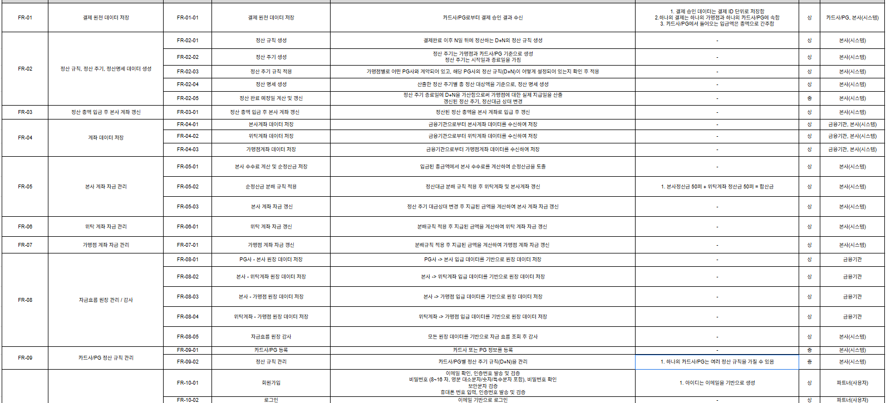<br/>
🔗[ 요구사항 명세서 ](https://docs.google.com/spreadsheets/d/1t-3yzFlvFUKhRYMtjQxSj4t5rjAZPjR0/edit?gid=1080029165#gid=1080029165)

---

# 5. 🧵 유스케이스
<p align="center">
  
</p>

---

# 6. 🧩 ERD
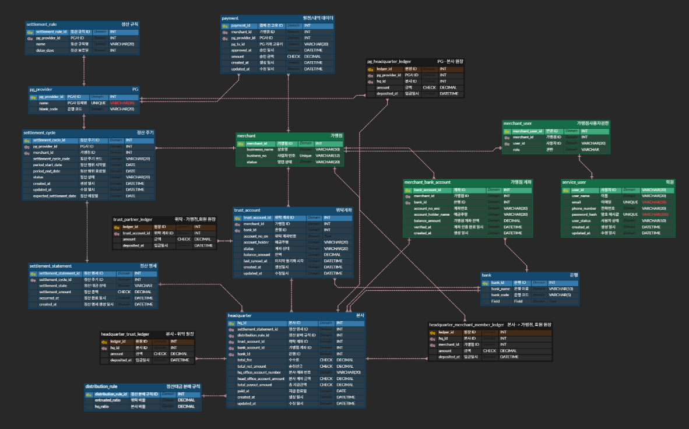
🔗[ ERD ](https://www.erdcloud.com/d/uzGd5MBTRGSqNebu2)

---

# 7. 🗃 테이블 명세서
<br/>
🔗[ 테이블 명세서 ](https://docs.google.com/spreadsheets/d/1HM-mU0-lc_Kd9HSFikO5GXxtWctQNYoIqnbgs6Q8_N0/edit?gid=993473287#gid=993473287)

---

# 8. 🗄️ SQL

<details>
    <summary>DDL</summary>

#### PG사 테이블
```sql
CREATE TABLE IF NOT EXISTS pg_provider ( 
    pg_provider_id INT AUTO_INCREMENT PRIMARY KEY,
    name VARCHAR(30) NOT NULL UNIQUE,
    bank_code VARCHAR(20) NOT NULL
);
```

#### 은행 테이블
```sql
CREATE TABLE IF NOT EXISTS bank (
    bank_id INT AUTO_INCREMENT PRIMARY KEY,
    bank_name VARCHAR(10) NOT NULL,
    bank_code VARCHAR(5) NOT NULL
);
```

#### 가맹점 테이블
```sql
CREATE TABLE IF NOT EXISTS merchant (
    merchant_id INT AUTO_INCREMENT PRIMARY KEY,
    business_name VARCHAR(50) NOT NULL,
    business_no VARCHAR(12) NOT NULL UNIQUE,
    status VARCHAR(20) NOT NULL DEFAULT 'ACTIVE' CHECK (status IN ('ACTIVE', 'INACTIVE', 'DISABLED'))
);
```

#### 정산 규칙 테이블
```sql
CREATE TABLE IF NOT EXISTS settlement_rule ( 
    settlement_rule_id INT AUTO_INCREMENT PRIMARY KEY,
    pg_provider_id INT NOT NULL,
    name VARCHAR(20) NOT NULL,
    delay_days INT,
    FOREIGN KEY (pg_provider_id) REFERENCES pg_provider(pg_provider_id)
);
```

#### 정산대금 분배 규칙 테이블
```sql
CREATE TABLE IF NOT EXISTS distribution_rule (
    distribution_rule_id INT AUTO_INCREMENT PRIMARY KEY,
    entrusted_ratio DECIMAL(10, 2) NOT NULL,
    hq_ratio DECIMAL(10, 2) NOT NULL
);
```

#### 원천/내역 데이터 테이블
```sql
CREATE TABLE IF NOT EXISTS payment (
    payment_id INT AUTO_INCREMENT PRIMARY KEY,
    merchant_id INT NOT NULL,
    pg_provider_id INT NOT NULL,
    pg_tx_id VARCHAR(20) NOT NULL,
    approved_at DATETIME NOT NULL,
    amount DECIMAL(18, 2) NOT NULL CHECK (amount >= 0),
    created_at DATETIME NOT NULL,
    updated_at DATETIME,
    FOREIGN KEY (merchant_id) REFERENCES merchant(merchant_id),
    FOREIGN KEY (pg_provider_id) REFERENCES pg_provider(pg_provider_id)
);
```

#### 정산 주기 테이블
```sql
CREATE TABLE IF NOT EXISTS settlement_cycle (
    settlement_cycle_id INT AUTO_INCREMENT PRIMARY KEY,
    settlement_cycle_code VARCHAR(20) NOT NULL,
    merchant_id INT NOT NULL,
    pg_provider_id INT NOT NULL,
    period_start_date DATE DEFAULT NULL,
    period_end_date DATE DEFAULT NULL,
    `status` VARCHAR(20) NOT NULL DEFAULT 'PENDING' CHECK (status IN ('PENDING', 'CALCULATED', 'REQUESTED', 'SETTLED', 'FAILED')),
    created_at DATETIME NOT NULL,
    updated_at DATETIME DEFAULT NULL,
    expected_settlement_date DATE DEFAULT NULL,
    FOREIGN KEY (merchant_id) REFERENCES merchant(merchant_id),
    FOREIGN KEY (pg_provider_id) REFERENCES pg_provider(pg_provider_id)
);
```

#### 정산 명세 테이블
```sql
CREATE TABLE IF NOT EXISTS settlement_statement (
    settlement_statement_id INT AUTO_INCREMENT PRIMARY KEY,
    settlement_cycle_id INT NOT NULL,
    settlement_state VARCHAR(20) NOT NULL,
    settlement_amount DECIMAL(18, 2) NOT NULL CHECK (settlement_amount >= 0),
    occurred_at DATETIME,
    created_at DATETIME NOT NULL,
    FOREIGN KEY (settlement_cycle_id) REFERENCES settlement_cycle(settlement_cycle_id)
);
```

#### 본사 테이블
```sql
CREATE TABLE IF NOT EXISTS headquarter (
    hq_id INT AUTO_INCREMENT PRIMARY KEY,
    settlement_statement_id INT NOT NULL,
    distribution_rule_id INT NOT NULL,
    merchant_id INT NOT NULL,
    trust_account_id INT NOT NULL,
    total_fee DECIMAL(18, 2) NOT NULL CHECK (total_fee >= 0),
    total_net_amount DECIMAL(18, 2) NOT NULL CHECK (total_net_amount >= 0),
    head_office_account_amount DECIMAL(18, 2) NOT NULL CHECK (head_office_account_amount >= 0),
    total_payout_amount DECIMAL(18, 2) NOT NULL CHECK (total_payout_amount >= 0),
    paid_at DATE NOT NULL,
    created_at DATETIME NOT NULL,
    updated_at DATETIME NOT NULL,
    hq_office_account_number VARCHAR(20) NOT NULL,
    bank_id INT NOT NULL,
    FOREIGN KEY (settlement_statement_id) REFERENCES settlement_statement(settlement_statement_id),
    FOREIGN KEY (distribution_rule_id) REFERENCES distribution_rule(distribution_rule_id),
    FOREIGN KEY (merchant_id) REFERENCES merchant(merchant_id),
    FOREIGN KEY (trust_account_id) REFERENCES trust_account(trust_account_id),
    FOREIGN KEY (bank_id) REFERENCES bank(bank_id) 
);
```

#### 위탁 계좌 테이블
```sql
CREATE TABLE IF NOT EXISTS trust_account (
    trust_account_id INT AUTO_INCREMENT PRIMARY KEY,
    merchant_id INT NOT NULL,
    bank_id INT NOT NULL,
    account_no_en VARCHAR(20) NOT NULL,
    account_holder VARCHAR(20) NOT NULL,
    status VARCHAR(20) NOT NULL,
    balance_amount DECIMAL(18, 2) NOT NULL CHECK (balance_amount >= 0),
    last_synced_at DATETIME NOT NULL,
    created_at DATETIME NOT NULL,
    updated_at DATETIME NOT NULL,
    FOREIGN KEY (merchant_id) REFERENCES merchant(merchant_id),
    FOREIGN KEY (bank_id) REFERENCES bank(bank_id)
);
```

#### 회원 테이블
```sql
CREATE TABLE IF NOT EXISTS service_user (
    user_id INT AUTO_INCREMENT PRIMARY KEY,
    user_name VARCHAR(20) NOT NULL,
    email VARCHAR(50) NOT NULL UNIQUE,
    phone_num VARCHAR(20) NOT NULL,
    password_hash VARCHAR(200) NOT NULL,
    user_status VARCHAR(10) NOT NULL DEFAULT 'ACTIVE',
    created_at DATETIME DEFAULT CURRENT_TIMESTAMP,
    updated_at DATETIME
);
```

#### 가맹점 사용자 권한 테이블
```sql
CREATE TABLE IF NOT EXISTS merchant_user_role (
    merchant_user_id INT AUTO_INCREMENT PRIMARY KEY,
    merchant_id INT DEFAULT NULL,
    user_id INT NOT NULL,
    user_role VARCHAR(10) NOT NULL DEFAULT 'VIEWER' CHECK (user_role IN ('OWNER', 'ADMIN', 'VIEWER', 'WITHDRAWN')),
    FOREIGN KEY (user_id) REFERENCES service_user(user_id),
    FOREIGN KEY (merchant_id) REFERENCES merchant(merchant_id) 
);
```

#### 가맹점 계좌
```sql
CREATE TABLE IF NOT EXISTS merchant_bank_account (
    bank_account_id INT AUTO_INCREMENT PRIMARY KEY,
    merchant_id INT NOT NULL,
    bank_id INT NOT NULL,
    account_no_en VARCHAR(20) NOT NULL,
    balance_amount DECIMAL(18, 2) NOT NULL,
    account_holder_name VARCHAR(20) NOT NULL,
    verified_at DATETIME DEFAULT CURRENT_TIMESTAMP,
    created_at DATETIME DEFAULT CURRENT_TIMESTAMP,
    account_status VARCHAR(20) NOT NULL DEFAULT 'ACTIVE' CHECK (account_status IN ('ACTIVE', 'INACTIVE')),
    FOREIGN KEY (merchant_id) REFERENCES merchant(merchant_id),
    FOREIGN KEY (bank_id) REFERENCES bank(bank_id)
);
```

#### PG-본사 간 원장 테이블
```sql
CREATE TABLE IF NOT EXISTS pg_headquarter_ledger (
    ledger_id BIGINT AUTO_INCREMENT PRIMARY KEY,
    pg_provider_id INT NOT NULL,
    hq_id INT NOT NULL,
    amount DECIMAL(18, 2) NOT NULL CHECK (amount <> 0),
    deposited_at DATETIME NOT NULL,
    FOREIGN KEY (pg_provider_id) REFERENCES pg_provider(pg_provider_id),
    FOREIGN KEY (hq_id) REFERENCES headquarter(hq_id)
);
```

#### 본사-가맹점,회원 간 원장 테이블
```sql
CREATE TABLE IF NOT EXISTS headquarter_merchant_member_ledger (
    ledger_id BIGINT AUTO_INCREMENT PRIMARY KEY,
    hq_id INT NOT NULL,
    merchant_id INT NOT NULL,
    amount DECIMAL(18, 2) NOT NULL CHECK (amount <> 0),
    deposited_at DATETIME NOT NULL,
    FOREIGN KEY (hq_id) REFERENCES headquarter(hq_id),
    FOREIGN KEY (merchant_id) REFERENCES merchant(merchant_id)
);

```

#### 본사-위탁 간 원장 테이블
```sql
CREATE TABLE IF NOT EXISTS headquarter_trust_ledger (
    ledger_id BIGINT AUTO_INCREMENT PRIMARY KEY,
    hq_id INT NOT NULL,
    trust_account_id INT NOT NULL,
    amount DECIMAL(18, 2) NOT NULL CHECK (amount <> 0),
    deposited_at DATETIME NOT NULL,
    FOREIGN KEY (hq_id) REFERENCES headquarter(hq_id),
    FOREIGN KEY (trust_account_id) REFERENCES trust_account(trust_account_id)
);
```

#### 위탁-가맹점,회원 간 원장 테이블
```sql
CREATE TABLE IF NOT EXISTS trust_partner_ledger (
    ledger_id BIGINT AUTO_INCREMENT PRIMARY KEY,
    trust_account_id INT NOT NULL,
    merchant_id INT NOT NULL,
    amount DECIMAL(18, 2) NOT NULL CHECK (amount <> 0),
    deposited_at DATETIME NOT NULL,
    FOREIGN KEY (trust_account_id) REFERENCES trust_account(trust_account_id),
    FOREIGN KEY (merchant_id) REFERENCES merchant(merchant_id)
);
```

</details>


<details>
    <summary>DML</summary>

#### FR-01 결제 원천 데이터 저장
```sql
-- FR-01-01 결제 원천 데이터 저장	
INSERT INTO payment (merchant_id, pg_provider_id, pg_tx_id, approved_at, amount, created_at) VALUES
(1, 1, 'TXN-JAN-01', '2026-01-19 10:00:00', 10000.00, '2026-01-19 10:05:00'),
(2, 2, 'TXN-JAN-02', '2026-01-19 11:30:00', 55000.00, '2026-01-19 11:35:00'),
(3, 3, 'TXN-JAN-03', '2026-01-20 01:00:00', 23000.00, '2026-01-20 01:05:00'),
(4, 4, 'TXN-JAN-04', '2026-01-20 02:20:00', 150000.00, '2026-01-20 02:25:00'),
(5, 5, 'TXN-JAN-05', '2026-01-20 03:40:00', 42000.00, '2026-01-20 03:45:00'),
(6, 6, 'TXN-JAN-06', '2026-01-20 04:00:00', 8800.00, '2026-01-20 04:05:00'),
(7, 7, 'TXN-JAN-07', '2026-01-20 05:15:00', 31000.00, '2026-01-20 05:20:00'),
(8, 8, 'TXN-JAN-08', '2026-01-20 06:50:00', 12500.00, '2026-01-20 06:55:00'),
(9, 9, 'TXN-JAN-09', '2026-01-20 07:30:00', 99000.00, '2026-01-20 07:35:00'),
(10, 10, 'TXN-JAN-10', '2026-01-20 08:45:00', 67000.00, '2026-01-20 08:50:00');
```

#### FR-02 정산 규칙, 정산 주기, 정산명세 데이터 생성
```sql

-- FR-02-01 정산 규칙 생성 결제완료 이후 N일 뒤에 정산하는 D+N의 정산 규칙 생성
INSERT INTO settlement_rule (pg_provider_id, name, delay_days) VALUES
(1, 'D+1 정산', 1), (2, 'D+3 정산', 3), (3, 'D+7 정산', 7), (4, 'D+2 정산', 2), (5, 'D+5 정산', 5),
(6, 'D+1 정산', 1), (7, 'D+3 정산', 3), (8, 'D+7 정산', 7), (9, 'D+1 정산', 1), (10, 'D+4 정산', 4);

SELECT sr.settlement_rule_id,
       pp.`name`,
       sr.`name`,
       sr.delay_days
FROM settlement_rule sr
JOIN pg_provider pp ON sr.pg_provider_id = pp.pg_provider_id
;
```

```sql
-- FR-02-02 "정산 주기는 가맹점과 카드사/PG 기준으로 생성 정산 주기는 시작일과 종료일을 가짐"
INSERT INTO settlement_cycle (
    settlement_cycle_code, 
    merchant_id, 
    pg_provider_id, 
    period_start_date, 
    period_end_date, 
    status, 
    created_at, 
    updated_at, 
    expected_settlement_date
) VALUES
('CYC-20260120-01', 1, 1, '2026-01-19', '2026-01-20', 'PENDING', '2026-01-20 09:00:00', '2026-01-20 09:30:00', '2026-01-21'),
('CYC-20260120-02', 2, 2, '2026-01-19', '2026-01-20', 'PENDING', '2026-01-20 09:00:00', '2026-01-20 09:30:00', '2026-01-23'),
('CYC-20260120-03', 3, 3, '2026-01-19', '2026-01-20', 'PENDING', '2026-01-20 09:00:00', '2026-01-20 09:30:00', '2026-01-27'),
('CYC-20260120-04', 4, 4, '2026-01-19', '2026-01-20', 'PENDING', '2026-01-20 09:00:00', '2026-01-20 09:30:00', '2026-01-22'),
('CYC-20260120-05', 5, 5, '2026-01-19', '2026-01-20', 'PENDING', '2026-01-20 09:00:00', '2026-01-20 09:30:00', '2026-01-25'),
('CYC-20260120-06', 6, 6, '2026-01-19', '2026-01-20', 'PENDING', '2026-01-20 09:00:00', '2026-01-20 09:30:00', '2026-01-21'),
('CYC-20260120-07', 7, 7, '2026-01-19', '2026-01-20', 'PENDING', '2026-01-20 09:00:00', '2026-01-20 09:30:00', '2026-01-23'),
('CYC-20260120-08', 8, 8, '2026-01-19', '2026-01-20', 'PENDING', '2026-01-20 09:00:00', '2026-01-20 09:30:00', '2026-01-27'),
('CYC-20260120-09', 9, 9, '2026-01-19', '2026-01-20', 'PENDING', '2026-01-20 09:00:00', '2026-01-20 09:30:00', '2026-01-21'),
('CYC-20260120-10', 10, 10, '2026-01-19', '2026-01-20', 'PENDING', '2026-01-20 09:00:00', '2026-01-20 09:30:00', '2026-01-24')
```
```sql
-- FR-02-03 정산 주기 규칙 적용 가맹점별로 어떤 PG사와 계약되어 있고, 해당 PG사의 정산 규칙(D+N)이 어떻게 설정되어 있는지 확인 후 적용

SELECT sc.settlement_cycle_id,
       sc.settlement_cycle_code,
       mer.business_name,
       pp.`name`,
       sr.`name`,
       sc.period_start_date,
       sc.period_end_date,
       sc.`status`
FROM settlement_cycle sc
JOIN merchant mer ON sc.merchant_id = mer.merchant_id
JOIN pg_provider pp ON sc.pg_provider_id = pp.pg_provider_id
JOIN settlement_rule sr ON sc.pg_provider_id = sr.settlement_rule_id
;
```
```sql
--  FR-02-04 정산 명세 일괄 생성 (영수증 다발 처리)
INSERT INTO settlement_statement (
    settlement_cycle_id,
    settlement_state,
    settlement_amount,
    occurred_at,
    created_at
)
SELECT
    sc.settlement_cycle_id,
    'REQUESTED',
    SUM(p.amount),
    NOW(),
    NOW()
FROM settlement_cycle sc
JOIN payment p ON p.merchant_id = sc.merchant_id
              AND p.pg_provider_id = sc.pg_provider_id
WHERE sc.status = 'PENDING' -- 아직 정산되지 않은 모든 주기들을 대상으로 함
  AND p.approved_at >= sc.period_start_date
  AND p.approved_at < DATE_ADD(sc.period_end_date, INTERVAL 1 DAY)
GROUP BY sc.settlement_cycle_id
```
```sql
-- FR-02-05 정산 완료 예정일 계산 및 갱신 "정산 주기 종료일에 D+N을 가산함으로써 가맹점에 대한 실제 지급일을 산출
-- 갱신된 정산 주기, 정산대금 상태 변경

UPDATE settlement_cycle sc
JOIN settlement_rule sr ON sc.pg_provider_id = sr.pg_provider_id
SET 
    sc.expected_settlement_date = DATE_ADD(sc.period_end_date, INTERVAL sr.delay_days DAY),
    sc.status = 'REQUESTED',
    sc.updated_at = NOW()
WHERE sc.status = 'CALCULATED';

UPDATE settlement_statement ss
JOIN settlement_cycle sc ON ss.settlement_cycle_id = sc.settlement_cycle_id
SET ss.settlement_state = 'READY'
WHERE sc.status = 'REQUESTED' AND ss.settlement_state = 'REQUESTED';
```

#### FR-03 정산 총액 입금 후 본사 계좌 갱신 	
```sql
-- FR-03-01 정산 총액 입금 후 본사 계좌 갱신
INSERT INTO pg_headquarter_ledger (pg_provider_id, hq_id, amount, deposited_at)
SELECT
    x.pg_provider_id,
    x.hq_id,
    x.total_amount AS amount,
    NOW() AS deposited_at
FROM (
    SELECT
        sc.pg_provider_id,
        h.hq_id,
        SUM(ss.settlement_amount) AS total_amount
    FROM settlement_cycle sc
    JOIN settlement_statement ss ON ss.settlement_cycle_id = sc.settlement_cycle_id
    JOIN headquarter h ON h.settlement_statement_id = ss.settlement_statement_id
    WHERE sc.expected_settlement_date = CURRENT_DATE
    GROUP BY sc.pg_provider_id, h.hq_id
) x
WHERE x.total_amount <> 0
  AND NOT EXISTS (
      SELECT 1
      FROM pg_headquarter_ledger l
      WHERE l.pg_provider_id = x.pg_provider_id
        AND l.hq_id = x.hq_id
        AND DATE(l.deposited_at) = CURRENT_DATE
        AND l.amount = x.total_amount
  );
  
UPDATE headquarter h
JOIN settlement_statement ss ON ss.settlement_statement_id = h.settlement_statement_id
JOIN settlement_cycle sc ON sc.settlement_cycle_id = ss.settlement_cycle_id
JOIN (
    SELECT
        l.hq_id,
        SUM(l.amount) AS deposited_total
    FROM pg_headquarter_ledger l
    WHERE DATE(l.deposited_at) = CURRENT_DATE
    GROUP BY l.hq_id
) d ON d.hq_id = h.hq_id
SET
    h.head_office_account_amount = COALESCE(h.head_office_account_amount, 0) + d.deposited_total,
    h.paid_at = CURRENT_DATE,
    h.updated_at = NOW()
WHERE
    sc.expected_settlement_date = CURRENT_DATE
    AND (h.paid_at IS NULL OR h.paid_at < CURRENT_DATE);
    
UPDATE settlement_statement ss
JOIN settlement_cycle sc ON sc.settlement_cycle_id = ss.settlement_cycle_id
SET ss.settlement_state = 'COMPLETED',
    ss.occurred_at = NOW()
WHERE sc.expected_settlement_date = CURRENT_DATE
  AND (ss.settlement_state IS NULL OR ss.settlement_state <> 'SETTLED')
  AND EXISTS (
      SELECT 1
      FROM headquarter h2
      JOIN pg_headquarter_ledger l2 ON l2.hq_id = h2.hq_id
      WHERE h2.settlement_statement_id = ss.settlement_statement_id
        AND DATE(l2.deposited_at) = CURRENT_DATE
  );
  
UPDATE settlement_cycle sc
SET sc.status = 'SETTLED',
    sc.updated_at = NOW()
WHERE sc.expected_settlement_date = CURRENT_DATE
  AND (sc.status IS NULL OR sc.status <> 'SETTLED')
  AND EXISTS (
      SELECT 1
      FROM settlement_statement ss
      JOIN headquarter h
        ON h.settlement_statement_id = ss.settlement_statement_id
      JOIN pg_headquarter_ledger l
        ON l.hq_id = h.hq_id
      WHERE ss.settlement_cycle_id = sc.settlement_cycle_id
        AND DATE(l.deposited_at) = CURRENT_DATE
  );
```
#### FR-04 계좌 데이터 저장	
```sql
-- FR-04-01 본사계좌 데이터 저장
INSERT INTO headquarter(settlement_statement_id, distribution_rule_id, merchant_id, trust_account_id, total_fee, hq_office_account_number, bank_id) VALUES
(1, 1, 1, 1, 500.00, 'HQ-001-1234', 2),
(2, 2, 2, 2, 2750.00, 'HQ-001-1234', 2),
(3, 3, 3, 3, 1150.00, 'HQ-001-1234', 2),
(4, 4, 4, 4, 7500.00, 'HQ-001-1234', 2),
(5, 5, 5, 5, 2100.00, 'HQ-001-1234', 2),
(6, 6, 6, 6, 440.00, 'HQ-001-1234', 2),
(7, 7, 7, 7, 1550.00, 'HQ-001-1234', 2),
(8, 8, 8, 8, 625.00, 'HQ-001-1234', 2),
(9, 9, 9, 9, 4950.00, 'HQ-001-1234', 2),
(10, 10, 10, 10, 3350.00, 'HQ-001-1234', 2);
```
```sql
-- FR-04-02 위탁계좌 데이터 저장
INSERT INTO trust_account (merchant_id, bank_id, account_no_en, account_holder, status) VALUES
(1, 1, '110-123-456', '위탁_아르카나', 'ACTIVE'),
(2, 2, '220-234-567', '위탁_랩', 'ACTIVE'),
(3, 3, '330-345-678', '위탁_식당', 'ACTIVE'),
(4, 4, '440-456-789', '위탁_학원', 'ACTIVE'),
(5, 5, '550-567-890', '위탁_패션', 'ACTIVE'),
(6, 6, '660-678-901', '위탁_마트', 'ACTIVE'),
(7, 7, '770-789-012', '위탁_플라워', 'ACTIVE'),
(8, 8, '880-890-123', '위탁_서점', 'ACTIVE'),
(9, 9, '990-901-234', '위탁_짐', 'ACTIVE'),
(10, 10, '000-012-345', '위탁_베이커리', 'ACTIVE');
```
```sql
-- FR-04-03 가맹점계좌 데이터 저장
INSERT INTO merchant_bank_account (merchant_id, bank_id, account_no_en, balance_amount, account_holder_name, verified_at, created_at) VALUES
(1, 1, '100-001-001', 10000, '김철수', '2025-01-16 00:00:00', '2025-01-16 00:00:00'),
(2, 2, '100-001-002', 25000, '이영희', '2025-02-21 00:00:00', '2025-02-21 00:00:00'),
(3, 3, '100-001-003', 5000, '박지민', '2025-03-06 00:00:00', '2025-03-06 00:00:00'),
(4, 4, '100-001-004', 120000, '최승우', '2025-04-13 00:00:00', '2025-04-13 00:00:00'),
(5, 5, '100-001-005', 0, '정다은', '2025-05-23 00:00:00', '2025-05-23 00:00:00'),
(6, 6, '100-001-006', 450000, '강민호', '2025-07-01 00:00:00', '2025-07-01 00:00:00'),
(7, 7, '100-001-007', 89000, '윤서연', '2025-07-19 00:00:00', '2025-07-19 00:00:00'),
(8, 8, '100-001-008', 34000, '임재희', '2025-08-06 00:00:00', '2025-08-06 00:00:00'),
(9, 9, '100-001-009', 210000, '한준서', '2025-09-15 00:00:00', '2025-09-15 00:00:00'),
(10, 10, '100-001-010', 56000, '오민지', '2025-10-26 00:00:00', '2025-10-26 00:00:00');
```
#### FR-05 본사 계좌 자금 관리	
```sql
-- FR-05-01 본사 수수료 계산 및 순정산금 저장

INSERT INTO headquarter (
	 hq_id,
	 settlement_statement_id,
	 distribution_rule_id,merchant_id, trust_account_id,
    total_fee, total_net_amount, 
    total_payout_amount, head_office_account_amount,
    paid_at, created_at, updated_at, hq_office_account_number, bank_id
)
SELECT  
	 10,
    ss.settlement_statement_id,
    dr.distribution_rule_id,
    sc.merchant_id,
    ta.trust_account_id,
    
    -- [수수료] 매출액의 5%
    (ss.settlement_amount * 0.05),
    
    -- [순정산금] 매출액 - 수수료
    (ss.settlement_amount - (ss.settlement_amount * 0.05)),
    
    0, 0, 
    CURDATE(), NOW(), NOW(), 'HQ-001-1234', 2
FROM settlement_statement ss
JOIN settlement_cycle sc ON ss.settlement_cycle_id = sc.settlement_cycle_id
JOIN trust_account ta ON sc.merchant_id = ta.merchant_id
JOIN distribution_rule dr ON dr.distribution_rule_id = 10 -- 분배 규칙 ID 10 
WHERE ss.settlement_statement_id = 10;
```
```sql
-- FR-05-02 순정산금 분배 규칙 적용

UPDATE headquarter h
JOIN distribution_rule dr ON h.distribution_rule_id = dr.distribution_rule_id
SET 
    -- [가맹점] 순정산금 * 위탁비율
    h.total_payout_amount = (h.total_net_amount * (dr.entrusted_ratio / 100)),
    
    -- [본사] 순정산금 * 본사비율 
    h.head_office_account_amount = (h.total_net_amount * (dr.hq_ratio / 100)),
    
    -- 수정일시 갱신
    h.updated_at = NOW()
WHERE h.hq_id = 10;
```
```sql
-- FR-05-03  본사 계좌 자금 갱신

UPDATE settlement_cycle 
SET 
    status = 'SETTLED', 
    updated_at = expected_settlement_date 
WHERE settlement_cycle_id = 10;

UPDATE headquarter h
JOIN settlement_cycle sc ON h.settlement_statement_id = sc.settlement_cycle_id
SET 
    h.paid_at = sc.expected_settlement_date, -- 지급일을 예정일(11/14)로 확정
    h.updated_at = CONCAT(sc.expected_settlement_date, ' 10:00:00') -- 수정일 오전 10시
WHERE h.hq_id = 10;

-- 잔액 갱신 (실제 지급액만큼 잔액 증가)
UPDATE trust_account ta
JOIN headquarter h ON ta.trust_account_id = h.trust_account_id
JOIN settlement_cycle sc ON h.settlement_statement_id = sc.settlement_cycle_id
SET 
    ta.balance_amount = ta.balance_amount + h.total_payout_amount,
    ta.last_synced_at = CONCAT(sc.expected_settlement_date, ' 10:00:00'),
    ta.updated_at = CONCAT(sc.expected_settlement_date, ' 10:00:00')
WHERE h.hq_id = 10;
```
#### FR-06 위탁 계좌 자금 관리	
```sql
-- FR-06-01 위탁 계좌 자금 갱신

UPDATE settlement_cycle 
SET 
    status = 'SETTLED', 
    updated_at = expected_settlement_date 
WHERE settlement_cycle_id = 10;

UPDATE headquarter h
JOIN settlement_cycle sc ON h.settlement_statement_id = sc.settlement_cycle_id
SET 
    h.paid_at = sc.expected_settlement_date, -- 지급일을 예정일(11/14)로 확정
    h.updated_at = CONCAT(sc.expected_settlement_date, ' 10:00:00') -- 수정일 오전 10시
WHERE h.hq_id = 10;

-- 3. 위탁 계좌(trust_account) 잔액 갱신 (실제 지급액만큼 잔액 증가)
UPDATE trust_account ta
JOIN headquarter h ON ta.trust_account_id = h.trust_account_id
JOIN settlement_cycle sc ON h.settlement_statement_id = sc.settlement_cycle_id
SET 
    ta.balance_amount = ta.balance_amount + h.total_payout_amount,
    ta.last_synced_at = CONCAT(sc.expected_settlement_date, ' 10:00:00'),
    ta.updated_at = CONCAT(sc.expected_settlement_date, ' 10:00:00')
WHERE h.hq_id = 10;

--
-- 원장 데이터에 없는 위탁계좌 id조회
SELECT ta.trust_account_id,
       ta.balance_amount
FROM trust_account ta
LEFT JOIN trust_partner_ledger l
       ON l.trust_account_id = ta.trust_account_id
WHERE l.trust_account_id IS NULL
  AND ta.balance_amount > 0;
  
-- 1. 위탁계좌 -
UPDATE trust_account ta
LEFT JOIN trust_partner_ledger l
  ON l.trust_account_id = ta.trust_account_id
SET ta.balance_amount = 0,
    ta.updated_at = NOW()
WHERE l.trust_account_id IS NULL
  AND ta.balance_amount > 0;

-- 2. 가맹점 +
UPDATE merchant_bank_account mba
JOIN trust_account ta
  ON ta.merchant_id = mba.merchant_id
LEFT JOIN trust_partner_ledger l
  ON l.trust_account_id = ta.trust_account_id
SET mba.balance_amount = mba.balance_amount + ta.balance_amount,
    mba.verified_at = NOW()
WHERE l.trust_account_id IS NULL
  AND ta.balance_amount > 0;
```
#### FR-07 가맹점 계좌 자금 관리	
```sql
-- FR-07-01 가맹점 계좌 자금 관리
-- 1) 지급되지 않은 가맹점 ID 조회
SELECT
  h.merchant_id,
  SUM(h.total_payout_amount) AS add_amount
FROM headquarter h
WHERE h.paid_at IS NOT NULL
  AND h.total_payout_amount > 0
  AND NOT EXISTS (
    SELECT 1
    FROM headquarter_merchant_member_ledger l
    WHERE l.hq_id = h.hq_id
      AND l.merchant_id = h.merchant_id
      AND l.amount = h.total_payout_amount
  )
GROUP BY h.merchant_id;


-- 1) 가맹점 잔액 +
UPDATE merchant_bank_account mba
JOIN (
  SELECT h.merchant_id, SUM(h.total_payout_amount) AS add_amount
  FROM headquarter h
  WHERE h.paid_at IS NOT NULL
    AND h.total_payout_amount > 0
    AND NOT EXISTS (
      SELECT 1
      FROM headquarter_merchant_member_ledger l
      WHERE l.hq_id = h.hq_id
        AND l.merchant_id = h.merchant_id
        AND l.amount = h.total_payout_amount
    )
  GROUP BY h.merchant_id
) x ON x.merchant_id = mba.merchant_id
SET mba.balance_amount = mba.balance_amount + x.add_amount
WHERE mba.account_status = 'ACTIVE';

-- 2) 본사 잔액 -
UPDATE headquarter h
SET h.head_office_account_amount = h.head_office_account_amount - h.total_payout_amount
WHERE h.paid_at IS NOT NULL
  AND h.total_payout_amount > 0
  AND h.head_office_account_amount >= h.total_payout_amount
  AND NOT EXISTS (
    SELECT 1
    FROM headquarter_merchant_member_ledger l
    WHERE l.hq_id = h.hq_id
      AND l.merchant_id = h.merchant_id
      AND l.amount = h.total_payout_amount
  );

SELECT * 
FROM payment;
```

#### FR-08 자금흐름 원장 관리 / 감사	
```sql
-- FR-08-01 PG사 - 본사 원장 데이터 저장
INSERT INTO pg_headquarter_ledger (pg_provider_id, hq_id, amount, deposited_at) VALUES
(1, 1, 10000.00, '2026-01-20 09:30:00'),
(2, 2, 55000.00, '2026-01-20 09:30:00'),
(3, 3, 23000.00, '2026-01-20 09:30:00'),
(4, 4, 150000.00, '2026-01-20 09:30:00'),
(5, 5, 42000.00, '2026-01-20 09:30:00'),
(6, 6, 8800.00, '2026-01-20 09:30:00'),
(7, 7, 31000.00, '2026-01-20 09:30:00');
```
```sql
-- FR-08-02 본사 - 위탁계좌 원장 데이터 저장
INSERT INTO headquarter_trust_ledger (hq_id, trust_account_id, amount, deposited_at) VALUES
(1, 1, 4750.00, '2026-01-20 10:05:00'),
(2, 2, 20900.00, '2026-01-20 10:05:00'),
(3, 3, 6555.00, '2026-01-20 10:05:00'),
(4, 4, 28500.00, '2026-01-20 10:05:00'),
(5, 5, 17955.00, '2026-01-20 10:05:00'),
(6, 6, 2926.00, '2026-01-20 10:05:00'),
(7, 7, 7362.50, '2026-01-20 10:05:00');
```
```sql
-- FR-08-03 본사 - 가맹점, 회원 원장 데이터 저장
INSERT INTO headquarter_merchant_member_ledger (hq_id, merchant_id, amount, deposited_at) VALUES
(1, 1, 4750.00, '2026-01-20 10:00:00'),
(2, 2, 31350.00, '2026-01-20 10:00:00'),
(3, 3, 15295.00, '2026-01-20 10:00:00'),
(4, 4, 114000.00, '2026-01-20 10:00:00'),
(5, 5, 21945.00, '2026-01-20 10:00:00'),
(6, 6, 5434.00, '2026-01-20 10:00:00'),
(7, 7, 22087.50, '2026-01-20 10:00:00');
```
```sql
-- FR-08-04 위탁계좌 - 가맹점 원장 데이터 저장
INSERT INTO trust_partner_ledger (trust_account_id, merchant_id, amount, deposited_at) VALUES
(1, 1, 4750.00, '2026-01-20 10:30:00'),
(2, 2, 20900.00, '2026-01-20 10:30:00'),
(3, 3, 6555.00, '2026-01-20 10:30:00'),
(4, 4, 28500.00, '2026-01-20 10:30:00'),
(5, 5, 17955.00, '2026-01-20 10:30:00'),
(6, 6, 2926.00, '2026-01-20 10:30:00'),
(7, 7, 7362.50, '2026-01-20 10:30:00');
```
```sql
-- FR-08-05 자금흐름 원장 감사
-- 가맹점 기준 전체 자금 흐름 타임라인 감사
SELECT
  flow_type,
  amount,
  deposited_at
FROM (
  SELECT
    'HQ_TO_MERCHANT' AS flow_type,
    amount,
    deposited_at
  FROM headquarter_merchant_member_ledger
  WHERE merchant_id = 100

  UNION ALL

  SELECT
    'TRUST_TO_MERCHANT' AS flow_type,
    amount,
    deposited_at
  FROM trust_partner_ledger
  WHERE merchant_id = 100
) t
ORDER BY deposited_at ASC;

-- 본사 기준 들어온 돈 vs 나간 돈 감사
SELECT
  h.hq_id,
  COALESCE(SUM(pgh.amount), 0) AS total_pg_in,
  COALESCE(SUM(hm.amount), 0) AS total_hq_to_merchant

FROM headquarter h
LEFT JOIN pg_headquarter_ledger pgh
  ON pgh.hq_id = h.hq_id
LEFT JOIN headquarter_merchant_member_ledger hm
  ON hm.hq_id = h.hq_id
WHERE h.hq_id = 300
GROUP BY h.hq_id;

-- 위탁계좌 기준 감사
SELECT
  t.trust_account_id,
  COALESCE(SUM(ht.amount), 0) AS total_hq_to_trust,
  COALESCE(SUM(tp.amount), 0) AS total_trust_to_merchant

FROM trust_account t
LEFT JOIN headquarter_trust_ledger ht
  ON ht.trust_account_id = t.trust_account_id
LEFT JOIN trust_partner_ledger tp
  ON tp.trust_account_id = t.trust_account_id
WHERE t.trust_account_id = 200
GROUP BY t.trust_account_id;

-- 정산 1건(hq_id) 단위 정합성 감사 
SELECT
  h.hq_id,
  ss.settlement_amount,
  h.total_net_amount,

  COALESCE(SUM(hm.amount), 0)
  + COALESCE(SUM(tp.amount), 0) AS actual_payout_amount

FROM headquarter h
JOIN settlement_statement ss
  ON ss.settlement_statement_id = h.status_statement_id

LEFT JOIN headquarter_merchant_member_ledger hm
  ON hm.hq_id = h.hq_id

LEFT JOIN trust_partner_ledger tp
  ON tp.merchant_id = h.merchant_id

WHERE h.hq_id = 300
GROUP BY h.hq_id, ss.settlement_amount, h.total_net_amount;
```
#### FR-09 카드사/PG 정산 규칙 관리	
```sql
-- FR-09-01 카드사/PG 등록

INSERT INTO pg_provider (name, bank_code) 
VALUES ('Global Pay', '004');
```
```sql
-- FR-09-02 정산 규칙 관리

INSERT INTO settlement_rule (
    pg_provider_id, 
    name, 
    delay_days
) VALUES (
    (SELECT pg_provider_id FROM pg_provider WHERE name = 'Global Pay'), 
    'D+7 정산', 
    7
);

UPDATE settlement_rule
SET 
    delay_days = 3,
    name = 'D+3 정산'
WHERE 
    pg_provider_id = (SELECT pg_provider_id FROM pg_provider WHERE name = 'Global Pay');
```
#### FR-10 회원 관리
```sql
-- FR-10-01 회원가입
SELECT NVL2(
	(SELECT user_id
	FROM service_user
	WHERE email = 'leesunsin@gmail.com'
	LIMIT 1),
	'중복된 아이디가 존재합니다.',
	'회원 가입 가능'
) AS '중복 체크';

INSERT INTO service_user (user_name, email, phone_num, password_hash)
VALUES ('이순신', 'leesunsin@gmail.com', '010-1234-5678', 'j665a45920422f9d417e4867efdc4fb8a04a1f3fff1fa07e998e86f7f7a27ae3');
```
```sql
-- FR-10-02 로그인
SET @user_id = (
	SELECT user_id
	FROM service_user
	WHERE email = 'leesunsin@gmail.com' 
	LIMIT 1
);
```
```sql
-- FR-10-03 로그 아웃
SET @user_id = NULL;
SET @user_name = NULL;
SET @merchant_id = NULL;
SET @pg_provider_id = NULL;
SET @settlement_statement_id = NULL;
SET @merchant_bank_account_num = NULL;
SET @merchant_balance_amount = NULL;
SET @trust_bank_account_num = NULL;
SET @trust_balance_amount = NULL;
```
```sql
-- FR-10-04 회원 탈퇴
SET @merchant_id = 1;

SELECT
    CASE
        WHEN NOT EXISTS (
            SELECT 1
            FROM settlement_cycle
            WHERE merchant_id = @merchant_id
              AND status <> 'SETTLED'
        )
        THEN '탈퇴 가능'
        ELSE '탈퇴 불가능'
    END AS '탈퇴 가능 여부';
    
    UPDATE merchant
SET status = 'DISABLED'
WHERE merchant_id = @merchant_id;

UPDATE merchant_bank_account
SET account_status = 'INACTIVE'
WHERE merchant_id = @merchant_id;

UPDATE trust_account
SET `status` = 'INACTIVE'
WHERE merchant_id = @merchant_id;
```
```sql
-- FR-10-05 가맹점 등록
SELECT NVL2(
	(SELECT merchant_id
	FROM merchant
	WHERE business_name = '엽기떡볶이 상도점'
	LIMIT 1),
	'중복된 가맹점이 존재합니다.',
	'가맹점 등록 가능'
) AS '가맹점 중복 체크';

SELECT NVL2(
	(SELECT merchant_id
	FROM merchant
	WHERE business_no = '113-47-64497'
	LIMIT 1),
	'중복된 사업자 번호가 존재합니다.',
	'사업자 등록 가능'
) AS '사업자 번호 중복 체크';


INSERT INTO merchant (business_name, business_no) 
VALUES ('엽기떡볶이 상도점', '113-47-64497');

SET @merchant_id = LAST_INSERT_ID();

UPDATE merchant_user_role
SET merchant_id = @merchant_id,
	 user_role = 'OWNER'
WHERE user_id = @user_id;
```
```sql
-- FR-10-06 가맹점 등록 해제
SET @merchant_id = 3;

UPDATE merchant
SET status = 'DISABLED'
WHERE merchant_id = @merchant_id;

UPDATE merchant_bank_account
SET account_status = 'INACTIVE'
WHERE merchant_id = @merchant_id;

UPDATE trust_account
SET `status` = 'INACTIVE'
WHERE merchant_id = @merchant_id;
```

#### FR-11 가맹점 관리	
```sql
-- FR-11-01 사업자 정보 등록 및 조회
SELECT user_role AS '가맹점에 대한 사용자 권한'
FROM merchant_user_role
WHERE merchant_id = @merchant_id
  AND user_id = @user_id
  AND user_role = 'OWNER'
LIMIT 1;

SET @user_name = (
	SELECT user_name
	FROM service_user
	WHERE user_id = @user_id
	LIMIT 1
);
```
```sql
-- FR-11-02 가맹점 계좌 정보 등록
UPDATE merchant_user_role
SET merchant_id = @merchant_id,
	 user_role = 'OWNER'
WHERE user_id = @user_id;

SET @user_name = (
	SELECT user_name
	FROM service_user
	WHERE user_id = @user_id
	LIMIT 1
);

INSERT INTO merchant_bank_account (
   merchant_id,
   bank_id,
   balance_amount,
   account_no_en,
   account_holder_name
)
VALUES (
   @merchant_id,
   6,
   0.0,
   '123456-01-615350',
   @user_name
);
```
```sql
-- FR-11-03 결제 대행사 선택
SELECT pg_provider_id
	INTO @pg_provider_id
FROM pg_provider
WHERE `name` = 'KG이니시스'
LIMIT 1;

INSERT INTO settlement_cycle (
    settlement_cycle_code,
    merchant_id,
    pg_provider_id,
    created_at
) VALUES (
    'TEMP',
    @merchant_id,
    @pg_provider_id,
    NOW()
);

SET @settlement_cycle_id = LAST_INSERT_ID();

UPDATE settlement_cycle
SET settlement_cycle_code = CONCAT(
    'CYC-',
    DATE_FORMAT(created_at, '%Y-%m-%d'),
    '-',
    LPAD(@settlement_cycle_id, 3, '0')
)
WHERE settlement_cycle_id = @settlement_cycle_id;

```
```sql
-- FR-11-04 사업자 유효성 검증
SELECT CASE
		 	WHEN `status` = 'ACTIVE' THEN '활성화'
		 	WHEN `status` = 'INACTIVE' THEN '비활성화'
		 	WHEN `status` = 'DISABLED' THEN '연결 해제'
		 	ELSE '알 수 없음'
		 END AS '사업자 유효성'
FROM merchant;

```
#### FR-12 정산 관리	
```sql
-- FR-12-01 정산 내역서 조회
SET @merchant_id = 2;

SELECT su.user_name
	INTO @owner_user_name
FROM service_user su
INNER JOIN merchant_user_role mur
	ON su.user_id = mur.user_id
WHERE mur.user_role = 'OWNER'
	AND mur.merchant_id = @merchant_id;
	
SELECT  m.business_name AS '상호명',
        pp.`name` AS 'PG사',
        @owner_user_name AS '대표자명',
        m.business_no AS '사업자 번호',
        sc.settlement_cycle_code AS '정산 코드',
        sc.period_start_date AS '정산 범위 시작일',
        sc.period_end_date AS '정산 범위 종료일',
        ss.settlement_amount AS '정산 총액',
        sc.created_at AS '정산 내역 생성일',
        sc.expected_settlement_date AS '정산 예정일'
FROM settlement_cycle sc
INNER JOIN settlement_statement ss
    ON sc.settlement_cycle_id = ss.settlement_cycle_id
INNER JOIN merchant m
    ON m.merchant_id = sc.merchant_id
INNER JOIN pg_provider pp
    ON pp.pg_provider_id = sc.pg_provider_id
INNER JOIN merchant_user_role mur
    ON mur.merchant_id = m.merchant_id
   AND mur.user_role = 'OWNER'
WHERE sc.`status` = 'SETTLED'
  AND m.merchant_id = @merchant_id;
```
```sql
-- FR-12-02 지급 내역서 조회
SELECT 
	CONCAT_WS(' ', bt.bank_name, mba.account_no_en),
	CONCAT(FORMAT(mba.balance_amount, 0), '원')
	INTO @merchant_bank_account_num,
		  @merchant_balance_amount
FROM merchant_bank_account mba
INNER JOIN bank bt
	ON mba.bank_id = bt.bank_id
WHERE mba.merchant_id = @merchant_id;

SELECT 
	CONCAT_WS(' ', bt.bank_name, ta.account_no_en),
	CONCAT(FORMAT(ta.balance_amount, 0), '원')
	INTO @trust_bank_account_num,
		  @trust_balance_amount
FROM trust_account ta
INNER JOIN bank bt
	ON ta.bank_id = bt.bank_id
WHERE ta.merchant_id = @merchant_id;

SELECT @owner_user_name AS '대표자명',
		 @business_no AS  '사업자번호',
		 @settlement_cycle_code AS '지급 건 식별자',
		 @pg_provider_id AS 'PG사',
	    @settlement_period AS '정산 기간',
	    CONCAT(FORMAT(hq.total_net_amount, 0), '원') AS '순정산금',
	    CONCAT(FORMAT(hq.total_fee , 0), '원') AS '수수료',
	    @trust_bank_account_num '위탁 계좌 번호',
		 @trust_balance_amount AS '위탁 계좌 잔액',
		 @merchant_bank_account_num AS '가맹점 계좌 번호',
	    @merchant_balance_amount AS '가맹점 계좌 잔액',
	    CONCAT(FORMAT(hq.total_payout_amount , 0), '원') AS '총 지급 금액',
	    hq.paid_at AS '지급 완료일'
FROM headquarter hq
WHERE hq.settlement_statement_id = @settlement_statement_id;

```
```sql
-- FR-12-03 정산 내역서 이의 제기
SET @merchant_id = 5;

SELECT `status`
FROM settlement_cycle
WHERE merchant_id = @merchant_id;

UPDATE settlement_cycle
SET `status` = 'FAILED'
WHERE merchant_id = @merchant_id;

```
</details> 

<details>
  <summary>Test Case</summary>
  <details>
      <summary>FR-01-01 : 결제 원천 데이터 저장 </summary>
       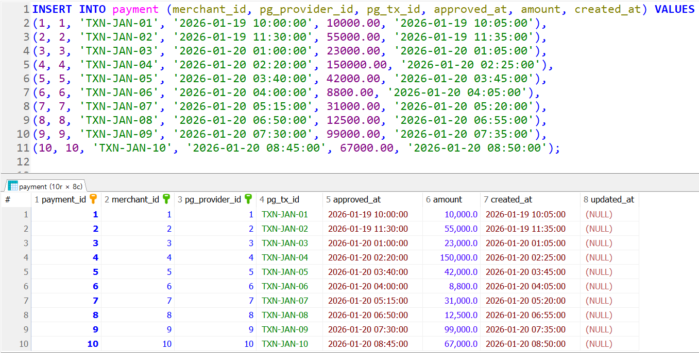
    
  </details>
  <details>
      <summary>FR-02-01 : 정산 규칙 생성 </summary>
       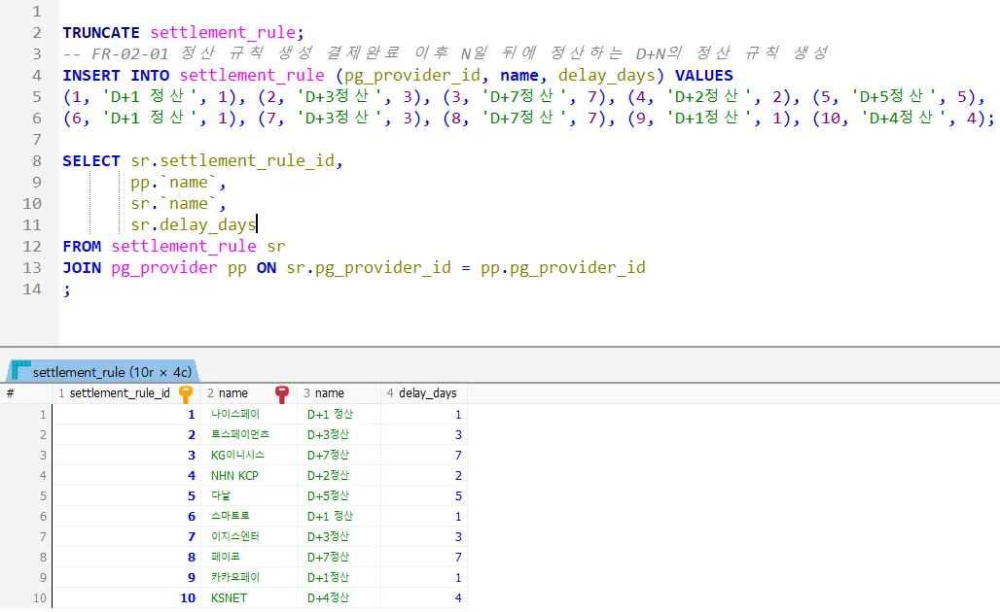
    
  </details>
  
  <details>
      <summary>FR-02-02 : 정산 주기 생성 </summary>
       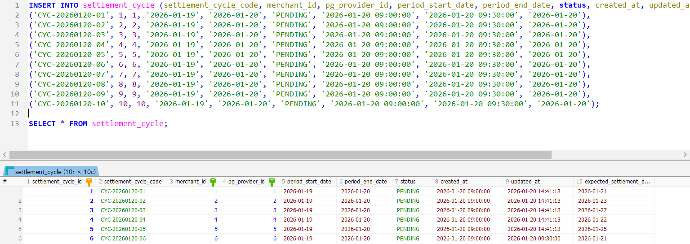
    
  </details>  
  
  <details>
      <summary>FR-02-03 : 정산 주기 규칙 적용 </summary>
       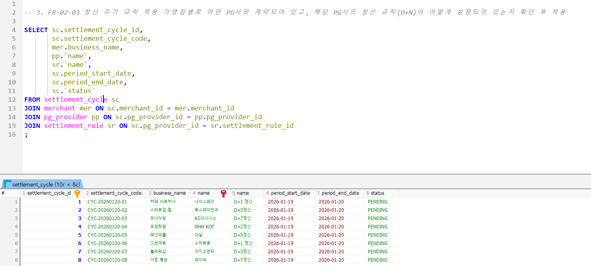
    
  </details>  

  <details>
      <summary>FR-02-04 : 정산 명세 생성 </summary>
       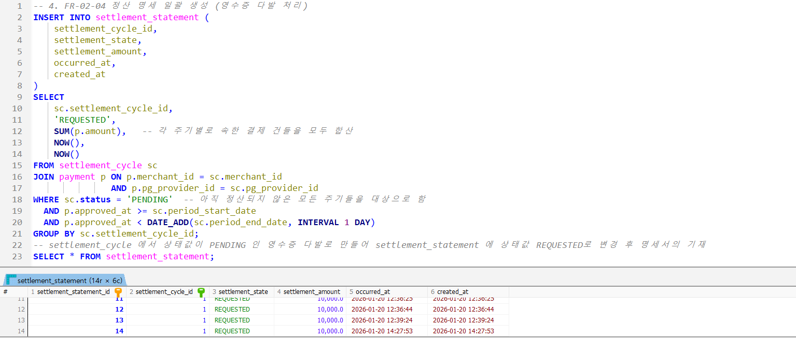
    
  </details>

  <details>
      <summary>FR-02-05 : 정산 완료 예정일 계산 및 갱신 </summary>
       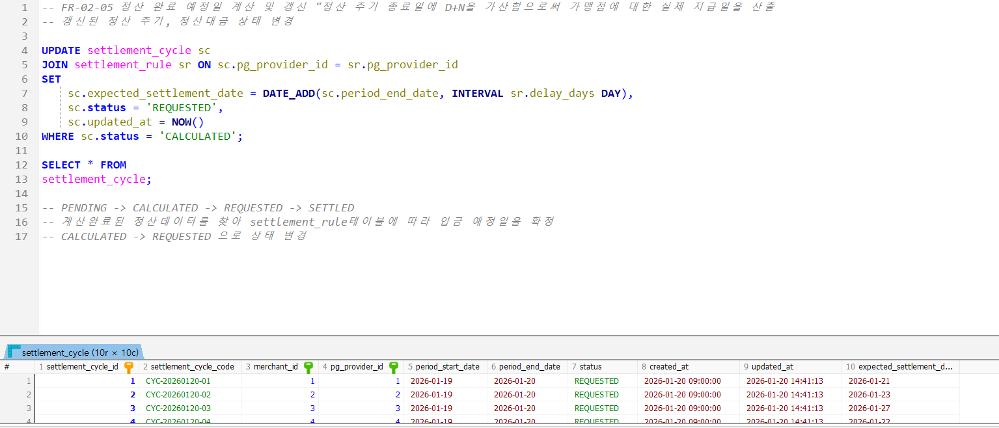
       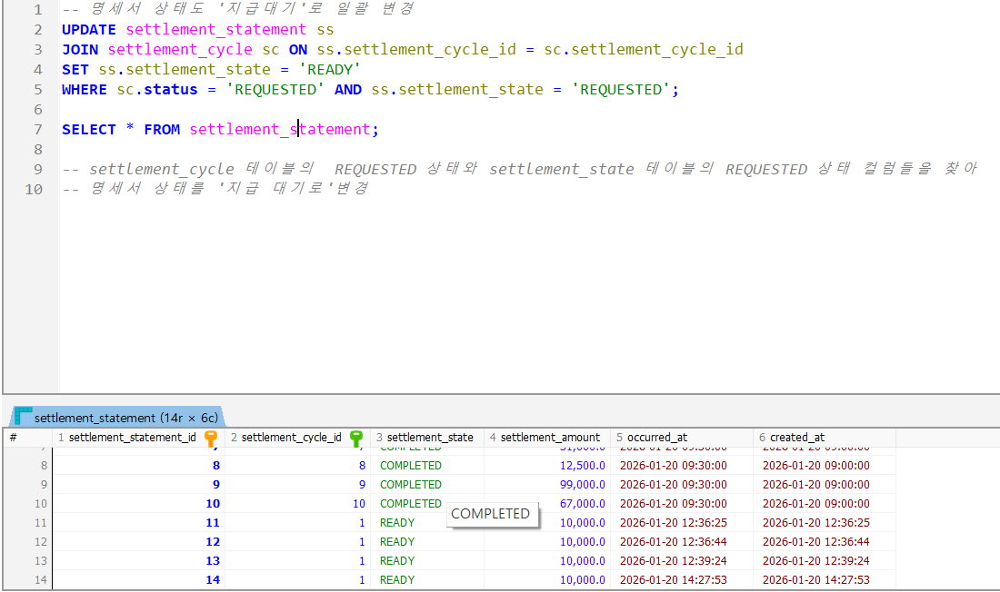
    
  </details>
  
  <details>
      <summary>FR-03-01 : 정산 총액 입금 후 본사 계좌 갱신 </summary>
       <h3>지급해야 할 PG사별 정산 총액 집계</h3>
       
       <h3>PG→본사 입금 원장 기록 저장</h3>  
       
       
       <h3>본사 계좌 갱신</h3>
       
       
       <h3>정산 명세 지급 완료 처리</h3>
       
       
       <h3>정산 주기 지급 완료 처리</h3>
       
       
  </details>  
  
  <details>
      <summary>FR-04-01 : 본사계좌 데이터 저장 </summary>
       
    
  </details>
  <details>
      <summary>FR-04-02 : 위탁계좌 데이터 저장 </summary>
       
    
  </details>
  <details>
      <summary>FR-04-03 : 가맹점계좌 데이터 저장 </summary>
       
    
  </details>
  <details>
      <summary>FR-05-01 : 본사 수수료 계산 및 순정산금 저장 </summary>
       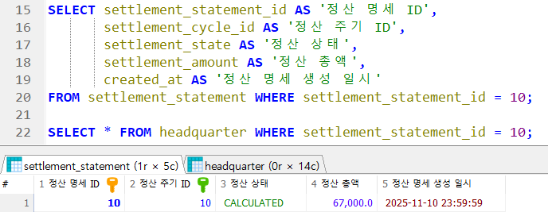
       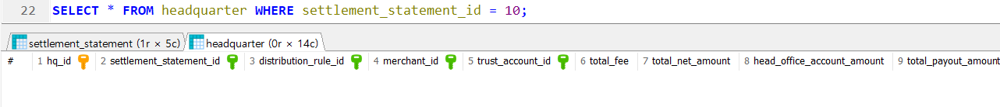
       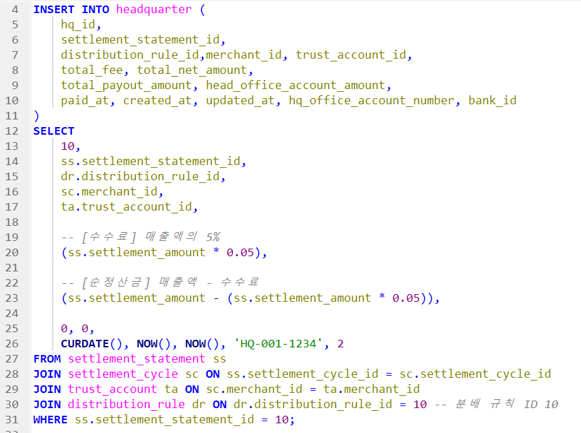
       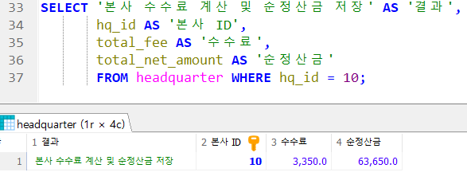
  </details>
  
  <details>
      <summary>FR-05-02 : 순정산금 분배 규칙 적용 </summary>
       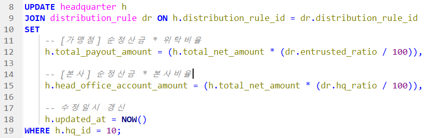
       
  </details>  
  
  <details>
      <summary>FR-05-03 :  본사 계좌 자금 갱신 </summary>
       
       
  </details>

  <details>
      <summary>FR-06-01 :  본사 계좌 자금 갱신 </summary>
       
       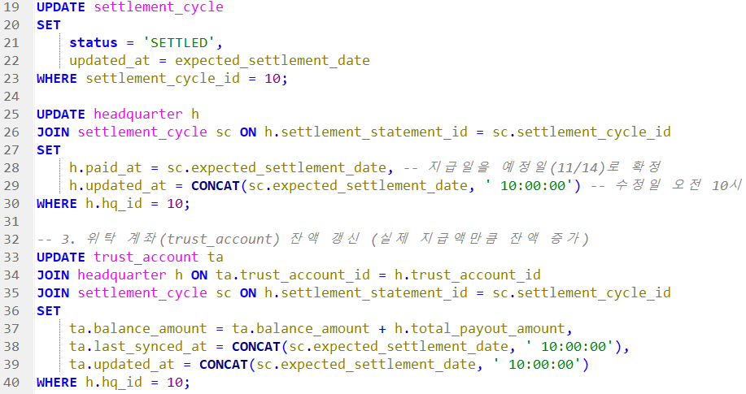
       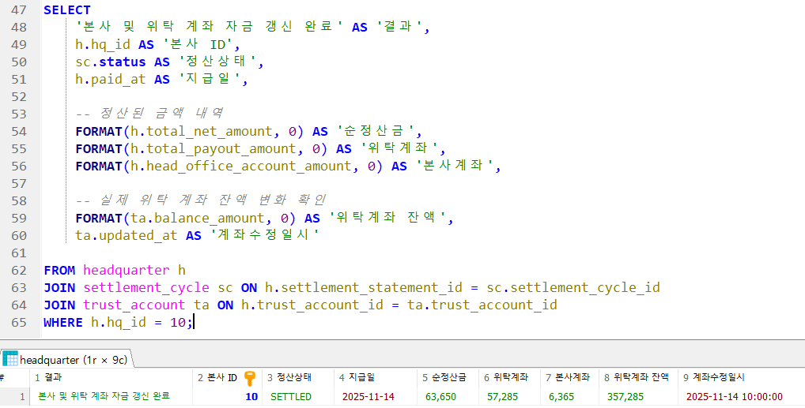
  </details>  

  <details>
      <summary>FR-06-02 :  위탁 계좌 자금 갱신 </summary>
       <br>
       <br>
       <br>
       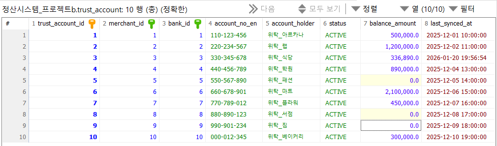<br>
       <br>
       <br>
       
  </details> 

  <details>
      <summary>FR-07-01 : 가맹점 계좌 자금 갱신 </summary>
       
       
       
       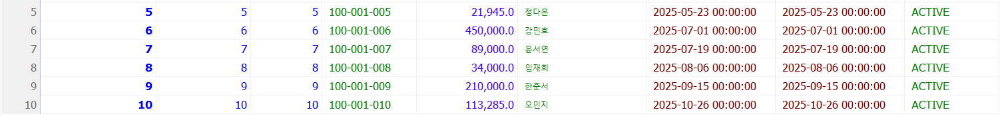
       
       
       
       
       
  </details>
  
  <details>
      <summary>FR-08-01 : PG사 -> 본사 원장 데이터 저장 </summary>
       
    
  </details>
  <details>
      <summary>FR-08-02 : 본사 - 위탁계좌 원장 데이터 저장 </summary>
       
    
  </details>
  <details>
      <summary>FR-08-03 : 본사 - 가맹점 원장 데이터 저장 </summary>
       
    
  </details>
  <details>
      <summary>FR-08-04 : 위탁계좌 - 가맹점 원장 데이터 저장 </summary>
       
    
  </details>
  <details>
      <summary>FR-08-05 : 자금흐름 원장 감사</summary>
       <h3>가맹점 기준 전체 자금 흐름 타임라인 감사</h3>
       
       <h3>본사 기준 들어온 돈 vs 나간 돈 감사</h3>
       
       <h3>위탁계좌 기준 감사</h3>
       
       <h3>정산 1건(hq_id) 단위 정합성 감사</h3>
       
    
  </details>
  
  <details>
      <summary>FR-09-01 : 카드사/PG 등록 </summary>
       
  </details>  
  
  <details>
      <summary>FR-09-02 : 정산 규칙 관리 </summary>
       
       
  </details>  

  <details>
      <summary>FR-10-01 : 회원 관리 </summary>
       
       
       
  </details>  

  <details>
      <summary>FR-10-02 : 로그인 </summary>
       
  </details>  
  

  <details>
      <summary>FR-10-03 : 로그아웃 </summary>
       
  </details> 

  <details>
      <summary>FR-10-04 : 회원 탈퇴 </summary>
       
       
       
       
       
       
       
       
       
       
  </details> 

  <details>
      <summary>FR-10-05 : 가맹점 등록 </summary>
       
       
       
  </details> 

  <details>
      <summary>FR-10-06 : 가맹점 등록 해제 </summary>
       
       
       
       
       
       
       
       
  </details> 

  <details>
      <summary>FR-11-01 : 사업자 정보 등록 및 조회 </summary>
       
       
       
  </details> 
  
  <details>
      <summary>FR-11-02 : 가맹점 계좌 정보 등록 </summary>
       
       
  </details> 

  <details>
      <summary>FR-11-03 : 결제 대행사 선택 </summary>
       
       
       
  </details> 

  <details>
      <summary>FR-11-04 : 사업자 유효성 검증 </summary>
       
  </details> 

  <details>
      <summary>FR-12-01 : 정산 내역서 조회 </summary>
       
       
       
  </details>

  <details>
      <summary>FR-12-02 : 지급 내역서 조회 </summary>
       
       
       
       
       
           
  </details>

  <details>
      <summary>FR-12-03 : 정산 내역서 이의제기 </summary>
       
       
       
  </details>

</details> 

---

# 9. 💬 팀회고

#### 🦊김진혁
> 시도하였던 것

그동안 많은 협업 경험이 있었지만, SW 프로젝트의 팀장을 맡은 것은 이번이 처음이었습니다. 리더로서 프로젝트 전반을 깊이 이해해야 한다는 책임감에 모든 과정에 적극적으로 참여하여, 크고 작은 사안마다 팀원들과 소통하며 의견을 조율했습니다. 특히 금융이라는 복잡한 주제에 도전하며 도메인 지식을 확장하기 위해 노력했습니다.

> 좋았던 점

열정적인 팀원들 덕분에 까다로운 주제를 성공적으로 풀어낼 수 있었습니다. 모든 팀원이 각자 맡은 역할을 끝까지 책임지고, 최선의 결과물을 위해 끊임없이 논의하며 수정해 나갔던 과정이 팀 전체에 큰 시너지를 만들어냈습니다.


> 아쉬웠던 점

첫 SW 프로젝트 리딩이다 보니, 전체적인 로드맵을 그리기보다 당면한 문제에 치중하여 다소 근시안적으로 팀을 이끈 점이 아쉽습니다. 또한 경험 부족으로 인해 결과물에 대한 확신이 부족했고, 이로 인해 신속한 의사결정을 내리지 못했던 점이 보완해야 할 과제로 남았습니다. 이를 해결하기 위해 다음 프로젝트 전까지 이전 기수의 우수 사례들을 분석하며 부족한 경험치를 채워 나갈 계획입니다.

#### 🐹박하얀
> 시도하였던 것


> 좋았던 점


> 아쉬웠던 점

#### 🐑양준석
> 시도하였던 것

플랫폼이 없는 시스템에서 DB만 설계하고 쿼리문을 돌려보는 프로젝트는 처음 진행해 보았습니다. 실질적으로 비즈니스시스템이 구현된 게 아니기 때문에 더미데이터를 이용해 API가 실행됐다고 가정하고 쿼리문을 돌리기를 시도했습니다. 시점마다 들어오는 데이터가 다르다 보니깐 각각의 쿼리문 작동방식을 이해하는데에 크게 도움이 된 것 같습니다.

> 좋았던 점

프로젝트를 참여할 때에 저는 프로젝트 진행 흐름을 따라가며 맡은 부분만 중요하게 생각하고 진행했습니다. 하지만 이번 프로젝트에서는 전체적인 흐름을 파악하며 팀원들이 맡은 부분들을 중간단계에 검수하면서 프로젝트 진행도를 확인하고 그 행동으로 인해 팀원들이 어려워하는 부분에 도움을 줄 수 있는 팀원이 될 수 있어서 좋았습니다.

> 아쉬웠던 점

프로젝트 주제를 신탁 기반 정산 시스템으로 선정하여 해당 도메인 분석과 시스템 설계에 큰 어려움을 겪었습니다. 이해하기 어려운 부분도 있었고 개념은 이해되었지만 시스템적으로 문제가 되는 부분도 발생하여 DB설계 자체를 명세 기준이 아닌 자금이라는 임의의 값을 집어넣어 직관적으로 구현하였습니다. 다음에 비슷한 시스템을 구현하게 된다면 실제로 사용되는 시스템과 거의 동일하게 구현하고 싶다고 생각했습니다.

#### 🥔이진
> 시도하였던 것

이전까지는 사용자 위주의 작은 주제를 갖고 프로젝트를 진행했지만 이번엔 B2B 관점의 신탁 기반 정산 시스템이라는 주제를 갖고 프로젝트를 진행해보았습니다. 생소하고 잘 알지 못하는 주제를 공부하고 전체 흐름을 쿼리문으로 구현하는 시도를 하며 이전보다 더 능숙하게 쿼리문을 작성할 수 있게 된 것 같습니다. 특히 이번엔 사용자 관점에서 쿼리문을 작성해보면서 사용자 시스템 흐름에 필요한 부분이 무엇인지 생각해볼 수 있었습니다.


> 좋았던 점

좋은 팀원분들과 함께 하게되어 주제에 대해 열성적으로 토론을 했던 점이 좋았습니다. 덕분에 어려운 주제를 선택했음에도 수월하게 프로젝트를 진행할 수 있었습니다. 또한 회의를 진행할 때 전체적인 내용을 정리하는 역할을 하며 회의를 진행할 수 있어 좋았습니다. 프로젝트 전반에 필요한 요구사항 명세서, 테이블 명세서도 이번 프로젝트를 통해 더 자세히 작성해볼 수 있어 좋았습니다.

> 아쉬웠던 점

요구사항을 작성할 때부터 쿼리문을 작성하고 프로젝트를 완성하기까지 사용자 관점을 담당한 부분이 아쉽습니다. 전체적인 흐름을 파악할 수 있던 역할이었지만 정산 시스템의 주요 기능을 쿼리문으로 작성보지 못했던 것 같습니다. 다음 프로젝트에는 주제의 주요 기능을 구현하는 부분을 맡아보고 싶습니다. 정산 시스템의 전 과정 중 결제 처리만 구현하였던 것이 아쉽습니다. 현실적인 제약 때문에 프로젝트의 규모를 축소하여 진행하였지만 다음에 기회가 된다면 시스템의 모든 과정을 구현해보고 싶습니다.

#### 👨‍🚒한규진
> 시도하였던 것
> 
프로젝트 주제를 금융 도메인으로 정한 직후, 팀 전반적으로 정산 과정에 대한 지식이 충분하지 않다는 것을 알았습니다. 이를 해결하고자 금융 거래와 자금 흐름을 기준으로 한 시나리오를 만들었습니다.
단순히 결제금액이 입금되고 계산하여 사용자가 조회하는 로직이 아니라, 계산상태와 정산상태가 변경함에 따라 자금 갱신 날짜 및 결제 예정일 일치 등의 데이터 무결성을 검증할 수 있는 테스트 케이스까지 볼 수 있는 기회를 얻었습니다.


> 좋았던 점
> 
작성한 시나리오를 바탕으로 팀원들과 흐름도를 함께 그려보며 머릿속 그림을 맞추는 과정을 거쳤습니다. 제가 구상한 정산 로직을 단순히 말로만 전달하기에는 한계가 있어서 흐름도를 그리게 된 것입니다. 그리고 시각화된 시나리오를 공유함으로써 모호했던 부분을 명확히 하고, 서로의 생각을 동기화해서 설계 단계의 오차를 줄일 수 있었습니다.

> 아쉬웠던 점
>
> 소통 과정에서 아쉬운 점이 있었습니다. 상대의 대답을 나의 언어로 다시 확인하는 '복명복창'을 확실하게 실천하지 못한 것입니다. 회의 중 잘못 이해하거나 모호한 부분이 생기면 질문을 던지기는 했지만, 그 답변에 대해 끝까지 크로스 체크하는 것을 철저히 지키지 못했습니다.

앞으로는 단순히 질문을 던지고 내가 생각하고 있는 답을 듣는 것에서 멈추지 않고, 상대의 답안을 나의 언어로 재정의해서 확인을 받는 습관을 길러야겠다고 다짐했습니다. 소통의 간극을 줄이는 확인 과정이 결국 설계의 완성도를 결정짓는 핵심임을 이번 프로젝트를 통해 크게 느끼게 되었습니다.

#### 🐻황희수
> 시도하였던 것

정산이라는 낯설고 복잡한 금융 데이터 흐름에 도전했습니다. 단순히 기능을 구현하는 것이 아닌, 실제 서비스라면 어떻게 동작해야 할지를 상상하며 돈의 흐름을 논리적으로 설계하려 했습니다. 이를 통해 정산 도메인에 대한 이해를 넓히고, 비즈니스 관점에서 데이터를 바라보는 시각을 기르기 위해 학습했습니다.

> 좋았던 점

초기에는 정산 용어와 로직이 어렵게만 느껴졌습니다. 하지만 팀원들과 이야기를 나누며 복잡한 흐름을 하나씩 이해해 갈 때 큰 성취감을 느꼈습니다. 특히 SQL이 단순 조회 도구가 아니라, 실제 비즈니스 로직을 담는 구현 언어라는 점이 깊이 이해하게 되었고, 데이터 중심 사고의 중요성을 깨닫는 계기가 되었습니다.

> 아쉬웠던 점

정산 흐름을 코드로만 바라보고 전체 프로세스로 연결하지 못해, 중간에 구조를 다시 이해해야 하는 시간이 필요했습니다. 기능이 돌아가는 결과에 집중하는 것이 아닌, 설계 의도와 흐름을 먼저 이해한 후 어떤 구조로 설계해야 하는지 충분히 고민하는 시간이 필요하다는 것을 체감했습니다.
